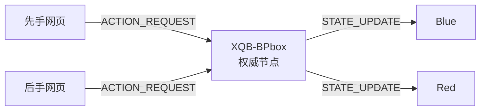
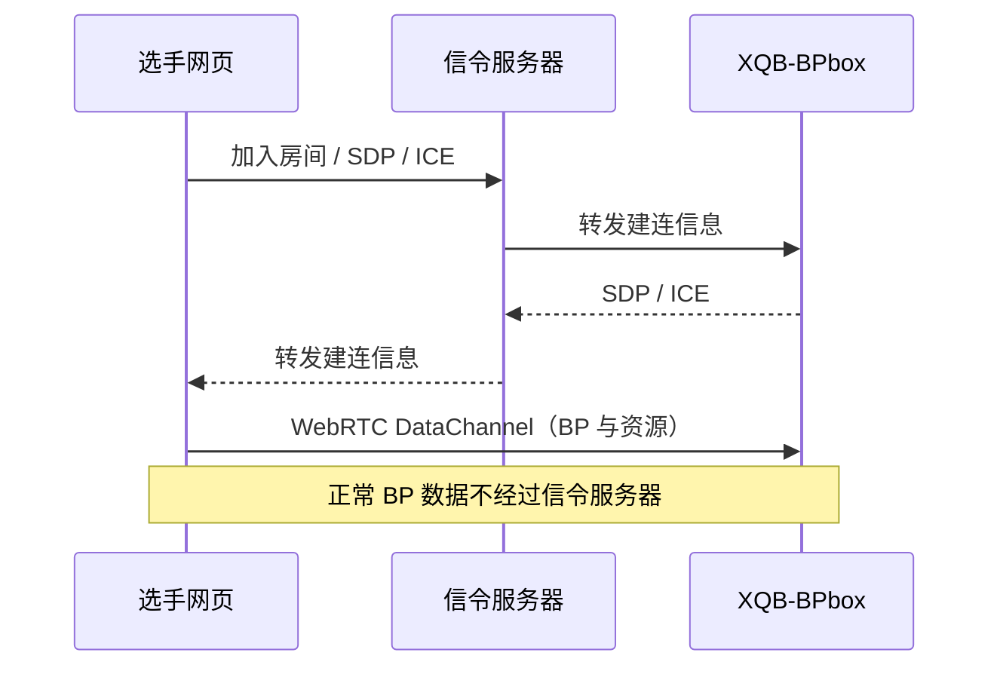
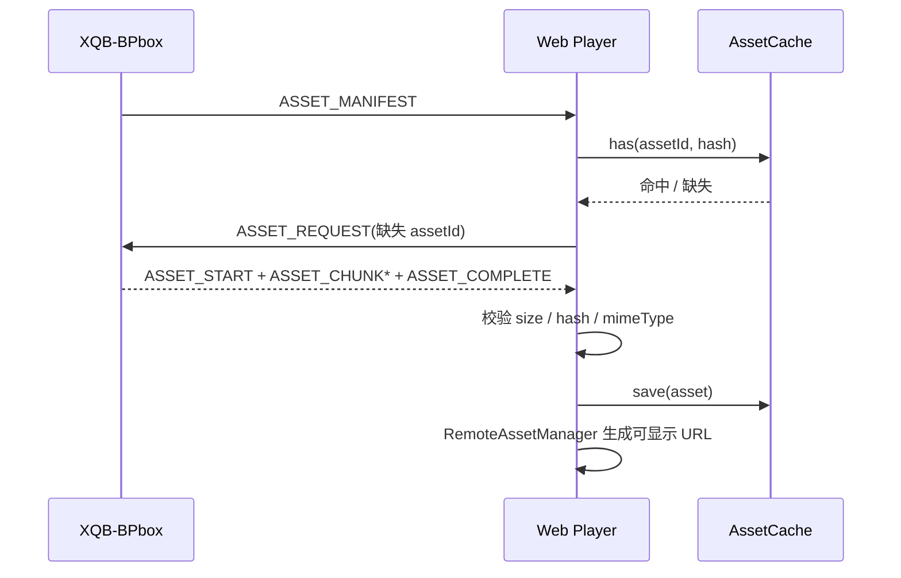
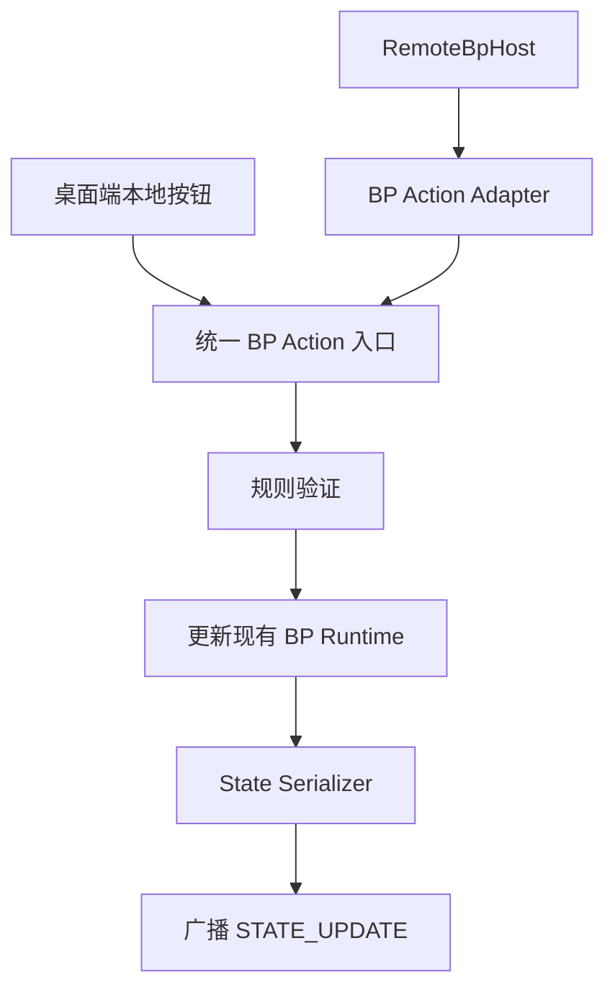

# XBQ-BPweb

## 1. 项目用途

`XBQ-BPweb` 是远程 BP 的选手端网页基础框架：

- 房主运行现有的 Electron 软件 `XQB-BPbox`。
- 先手和后手选手分别在浏览器打开部署后的网页。
- 网页通过 WebRTC DataChannel 与房主通信。
- XQB-BPbox 始终是 BP 的权威节点（authoritative host）。

网页是不可信客户端。它可以显示房主下发的状态并提交 `ACTION_REQUEST`，但不能自行决定一个 BAN、PICK、保护或租借操作已经生效。只有收到房主的新 `RemoteBpState` 后，页面才更新正式结果。

项目名和目录遵循本次约定，使用 `XBQ-BPweb`；需要注意桌面端产品名仍为 `XQB-BPBox`。

## 2. 当前完成情况

### 已实现

- React 19 + TypeScript + Vite 独立网页项目。
- 加入房间页和 BP 选手操作页。
- `/room/ABCDEFG` 房间路径解析和预填。
- `RemoteBpConnection` 通信抽象。
- `MockRemoteBpConnection`、模拟延迟、对手自动操作及 revision 递增。
- 集中的客户端/房主消息协议和统一 envelope。
- 可扩展的 `BpAction`、`RemoteBpState`、角色网络 DTO。
- `AssetManifest`、`AssetCache`、`MemoryAssetCache`、`RemoteAssetManager`。
- Mock Manifest 与通过连接层返回的 Mock Blob 资源。
- 外部可观察 Session Store；React 组件不解析协议，也不修改正式 BP State。
- `idle / connecting / connected / reconnecting / disconnected / failed` 连接状态模型。
- XQB-BPbox `BpActionDispatcher`，本地 BAN / PICK / PROTECT / BORROW 已复用统一入口。
- XQB-BPbox 纯 `RemoteBpState` Serializer 与集中式 star/rail ↔ first/second 映射。
- XQB-BPbox `RemoteAssetProvider`，使用无路径 Manifest、图片白名单与 SHA-256。
- XQB-BPbox `RemoteBpHost`、`RemoteHostTransport` / Mock Transport 基础层。
- XQB-BPbox “远程 BP”房主管理 UI。
- WebSocket Signaling Server、HOST/FIRST/SECOND 槽位和房间生命周期。
- BPbox / Web Signaling Client、`RTCPeerConnection` 与 WebRTC DataChannel。
- 网络消息 runtime validation、64 KiB 信令上限和 512 KiB BP 消息上限。
- 可配置 STUN/TURN `iceServers` 与基础 ICE Restart。
- 真实角色头像小图/全身立绘传输、128 KiB 分片、发送背压与接收端 size/hash/MIME 校验。

### 尚未实现

- 生产 TURN 服务与公网 WSS 部署。
- 跨信令断线的稳定 session 身份恢复。
- IndexedDB 持久缓存。
- 独立二进制资源通道与传输取消；当前资源使用有大小上限的 Base64 JSON 分片。

Mock 模式仍可用于离线 UI 演示；真实联调请使用默认的 `webrtc` 配置。

## 3. 项目目录

```text
XBQ-BPweb/
├─ public/                         静态公开文件（当前不存放真实角色素材）
├─ src/
│  ├─ components/                 纯展示与交互组件
│  ├─ config/                     运行模式配置
│  ├─ hooks/                      Store / AssetManager 的 React 订阅适配
│  ├─ mocks/                      Mock 角色、流程、Manifest 和 Mock 资源生成
│  ├─ pages/                      Join Page 与 BP Page
│  ├─ protocol/                   统一 message type、envelope、payload 类型
│  ├─ services/                   Connection 接口、Mock 连接和连接工厂
│  │  └─ assets/                  AssetCache 与 RemoteAssetManager
│  ├─ stores/                     权威远端状态的客户端投影 Store
│  ├─ types/                      BP、连接、资源 DTO
│  ├─ App.tsx                     组合服务并选择页面
│  ├─ main.tsx                    React 入口
│  └─ styles.css                  全局视觉与响应式布局
├─ .env.example                   Mock / WebRTC 模式配置示例
├─ package.json
├─ README.md
└─ WEB_GUIDE.md
```

职责边界：

- `pages/components` 不接触 WebRTC、DataChannel、Blob 分片或协议 envelope。
- `stores` 接收连接事件，仅接受 revision 不落后的远端状态。
- `services/RemoteBpConnection.ts` 是页面业务语义和传输实现之间的边界。
- `protocol` 只定义线上消息，不依赖具体 WebRTC 实现。
- `services/assets` 把 Manifest、缓存和 Blob 转为组件可用的浏览器 URL。
- `mocks` 可被删除或替换，而无需重写页面。

## 4. 页面结构

### Join Page

加入页提供：

- 4–12 位房间号输入。
- 先手 / 后手身份选择。
- 加入房间按钮。
- 统一连接状态与错误提示。
- `/room/<roomId>` 路径预填。

提交后调用 `RemoteBpSessionStore.join()`，Store 再调用 `RemoteBpConnection.connect()`。页面没有 `if (mock)` 分支。

### BP Page

BP 页展示：

- 身份、房间号、连接状态、Mock/P2P 传输标识和延迟预留。
- BP 阶段、当前操作者、当前操作、步骤和 revision。
- 先手/后手已 BAN 与已 PICK 角色。
- 可操作角色和不可操作角色。
- 当前选中角色与确认按钮。
- 资源加载计数和操作结果消息。

当 `currentActor` 不是当前身份时，页面派生显示 `WAIT`，角色按钮和确认按钮禁用。页面只派生显示状态，不会修改 `RemoteBpState`。

## 5. BP 网络架构

正常 BP 数据只在玩家和房主之间传输：



WebRTC 建连时需要信令服务交换 offer、answer 和 ICE candidate；建连后，正常 BP 数据不应绕行信令服务器：



## 6. RemoteBpConnection

接口位于 `src/services/RemoteBpConnection.ts`，当前职责为：

```ts
interface RemoteBpConnection {
  connect(options: RemoteBpConnectOptions): Promise<void>;
  disconnect(): Promise<void>;
  sendAction(action: BpAction): Promise<void>;
  requestState(lastKnownRevision?: number): Promise<void>;
  requestAssets(assetIds: string[]): Promise<void>;
  getSnapshot(): ConnectionSnapshot;
  on(event, listener): Unsubscribe;
}
```

事件包括：

- `connectionStateChanged`
- `bpStateReceived`
- `bpStateUpdated`
- `actionResult`
- `assetManifestReceived`
- `assetReceived`
- `error`

未来新增 `WebRtcRemoteBpConnection` 时，它应实现同一接口，并负责：

1. 通过独立的 Signaling Client 完成 SDP/ICE 交换。
2. 创建和维护 `RTCPeerConnection`。
3. 打开 `bp-control` 与 `bp-assets` DataChannel。
4. 将接口方法序列化为 `ClientMessage`。
5. 将房主消息解析、校验后转成接口事件。
6. 维护 `connecting / connected / reconnecting / failed` 状态。
7. 处理 Ping、ICE Restart、自动重连和最后已知 revision。

`src/services/createRemoteBpConnection.ts` 是唯一运行模式选择点。未来只需让 `webrtc` 分支返回真实实现；React 页面无需变化。

## 7. 网络协议

协议集中在 `src/protocol/`。所有消息使用统一 envelope：

```ts
interface ProtocolEnvelope<TType, TPayload> {
  type: TType;
  protocolVersion: "1.1.1";
  messageId: string;
  requestId?: string;
  sentAt: string;
  payload: TPayload;
}
```

客户端 → 房主：

| Type             | 用途                                  |
| ---------------- | ------------------------------------- |
| `HELLO`          | 声明客户端版本和能力                  |
| `JOIN`           | 请求以先手/后手身份和展示名称加入房间 |
| `ACTION_REQUEST` | 提交一个 `BpAction`                   |
| `STATE_REQUEST`  | 请求完整状态或重连恢复                |
| `ASSET_REQUEST`  | 请求缓存中缺失的 assetId              |
| `PING`           | 延迟和存活检查                        |

房主 → 客户端：

| Type             | 用途                    |
| ---------------- | ----------------------- |
| `WELCOME`        | 确认会话、房间与身份    |
| `INITIAL_STATE`  | 下发完整初始状态        |
| `STATE_UPDATE`   | 下发新的权威状态        |
| `ACTION_RESULT`  | 明确接受或拒绝请求      |
| `ASSET_MANIFEST` | 下发资源清单            |
| `ASSET_START`    | 声明二进制传输开始      |
| `ASSET_CHUNK`    | 传输资源分片            |
| `ASSET_COMPLETE` | 声明资源传输完成和 hash |
| `PONG`           | 回应 Ping               |
| `ERROR`          | 协议、会话或传输错误    |

关键字段：

- `protocolVersion`：在双方不兼容时尽早拒绝，避免错误解释消息。
- `messageId`：每条消息的唯一标识，用于追踪和排错。
- `requestId`：将响应关联到请求；房主可用于幂等和重复请求检测。
- `revision`：权威状态的单调递增版本，防止旧包覆盖新状态，并支持乱序处理、状态恢复和重连。

当前控制与图片分片共用 ordered DataChannel。`ASSET_CHUNK.data` 是单个原始 128 KiB 分片的 Base64，单消息仍受 512 KiB 上限约束；发送队列通过 `bufferedAmount` 实施背压。后续如果加入视频等大资源，应改用独立二进制通道。

## 8. BPAction

`BpAction` 是网页能提交的统一操作请求，公共字段包括：

- `actionId`：幂等键。
- `actorSide`：声称的操作方；房主仍必须以 Peer 身份重新验证。
- `expectedRevision`：客户端提交时看到的状态版本。
- `stepIndex`：客户端看到的步骤，仅供验证，不是推进指令。
- `createdAt`：诊断时间戳。

当前类型支持：

- `SELECT`：选择角色。
- `DESELECT`：取消选择。
- `BAN`、`PICK`：可用于未来允许直接提交目标的流程。
- `CONFIRM`：确认当前选择。
- `PROTECT`、`BORROW`：双目标扩展，与现有 XQB-BPbox 流程能力对齐。
- `CUSTOM`：带命名扩展和 JSON 数据的未来协议扩展点。

当前 UI 的点击流程是：

```text
选择角色 -> ACTION_REQUEST(SELECT) -> 房主状态更新
点击确认 -> ACTION_REQUEST(CONFIRM) -> 房主验证 -> STATE_UPDATE
```

Mock 也遵循该边界。Store 不会在发送请求后把角色直接写进 bans/picks。

## 9. RemoteBpState

`RemoteBpState` 不是 Electron `BpRuntimeState` 的直接复制，而是网页所需的最小网络投影。它包括：

- `schemaVersion` 与 `revision`。
- 会话、房间、流程名和运行状态。
- 当前 phase、actor、operation 和 step。
- 先手/后手基本信息及选手或队伍展示名称。
- 简化后的角色 DTO 与光锥 DTO。
- 角色/光锥 bans、picks、protections、borrows，以及双方的带目标类型预选。
- 全局及分侧的可用 / 不可用目标 ID。
- `confirmedSides`、`canConfirm` 与 `canConfirmBySide`。
- 可选倒计时投影。

状态同步规则：

1. 首次连接接收 `INITIAL_STATE`。
2. 每个合法操作后房主生成新 revision，并广播 `STATE_UPDATE`。
3. Store 忽略 revision 小于当前 revision 的旧状态。
4. revision 不匹配的动作由房主返回 `STALE_REVISION`，网页请求完整状态后再操作。
5. 重连时网页携带最后 revision；房主可以下发增量或直接下发最新完整状态。

当前项目采用“完整小 DTO + revision”的简单方案。状态体量足够小时，比过早实现复杂 patch 协议更安全。

## 10. AssetManifest

角色 DTO 中的 `avatar`、`portrait` 与光锥 DTO 中的 `image` 都是 assetId，不是 URL，更不是桌面端本地路径。`AssetManifestEntry` 包含：

- `assetId`
- `type`（avatar / portrait / light-cone）
- `hash`
- `size`
- `mimeType`
- `characterId` / `lightConeId` / `ownerId`

资源流程：



当前使用 `MemoryAssetCache`；刷新页面后缓存消失。未来可新增 `IndexedDbAssetCache implements AssetCache`，替换 App 中的实例化代码，不需要改组件。

资源采用按需加载：角色阶段先请求角色池实际显示的头像，只有选中目标时才请求其立绘；光锥小图在进入光锥阶段后请求。组件在同一轮渲染中产生的请求会合并成批次，避免开房后立即传输所有大图。

当前 Mock 图片是 `MockRemoteBpConnection` 生成并通过 `assetReceived` 事件交给资源管理器的 Blob。React 组件从 `RemoteAssetManager` 获取 URL，因此不依赖 Mock Blob、DataChannel 或房主文件路径。

## 11. XQB-BPbox 当前房主底座

### RemoteBpHost

桌面端已经增加独立 Host 层，且没有把 WebRTC 逻辑放进 `ConsolePage.tsx`。`RemoteBpHost` 当前负责：

- 创建和关闭房间。
- 保存 Blue Peer 与 Red Peer 的身份和连接状态占位。
- 接收、去重和追踪 `ACTION_REQUEST`。
- 调用 BP Action Adapter。
- 在状态变化后广播 `STATE_UPDATE`。
- 提供 AssetManifest 和资源数据。
- 维护 Mock 生命周期和必要的房主 UI 状态。

身份抢占、HELLO/JOIN、protocolVersion、STATE_REQUEST、Ping、重连与 ICE 状态仍待真实传输阶段实现。

房主必须检查：

- 当前是否轮到该 Peer 对应的玩家。
- 请求动作是否与当前 BP 步骤一致。
- 目标类型和角色是否可选。
- 角色是否已被 Pick、Ban、保护或占用。
- `expectedRevision` 是否等于当前 revision。
- `actionId` / `requestId` 是否重复。
- PROTECT / BORROW 等双目标规则是否满足。

### BP Action Adapter

Adapter 将网络 `BpAction` 转换成现有 XQB-BPbox 的 BP 操作。现有桌面端内部使用 `star / rail`，远端 DTO 使用 `first / second`；应由房主房间配置明确保存映射，例如：

```text
first  -> star（先手）
second -> rail（后手）
```

不要让网页猜测此映射。

桌面端统一入口已经实现为：

```ts
BpActionDispatcher.dispatch(action, source, snapshot, executor, mapping);
```

本地按钮和远程操作最终都进入同一个 BP Action 入口：



本地 BAN、PICK、PROTECT、BORROW 已通过该入口再调用原有 BP Runtime 更新逻辑；SELECT、DESELECT、CONFIRM 已由 Dispatcher 支持，供远程流程使用。撤回、清空、流程切换、读取结果仍保留房主管理兼容链，并在 Mock 房间开启时显式推进权威 revision。

### Asset Provider

桌面端已经提供：

```ts
getAssetManifest(): Promise<AssetManifest>
getAsset(assetId: string): Promise<{ descriptor: AssetManifestEntry; data: Uint8Array }>
```

Provider 维护受控的 assetId → 本地资源映射，只允许角色的 `avatar_small_image`、`full_body_image` 和光锥小图，并生成 SHA-256、size 和 MIME。文件大小和修改时间未变化时复用已计算的描述与哈希，只有新增或变化的文件会重新异步哈希。Manifest 不含路径，未知、路径式、空文件、非图片或超过 64 MiB 的资源会被拒绝。Host 已按选手端 `ASSET_REQUEST` 经 DataChannel 分片传输这些文件。

### State Serializer

纯函数 Serializer 已负责把现有 `BpRuntimeState`、角色数据和房间映射转换成 `RemoteBpState`：

- `FlowStep.side` 的 `star / rail` 转为房间分配的 `first / second`。
- `pick / ban / protect / borrow` 转为大写协议枚举。
- `Character` 只保留网页需要的名称、属性、命途、两个图片 assetId，以及 BP 操作所需的 ID/状态字段。
- `LightCone` 只保留网页需要的名称、命途、小图 assetId，以及 BP 操作所需的 ID/状态字段。
- 角色与光锥的内部图片路径只转为 Asset Provider 的 assetId，不直接出现在网络 DTO。
- 生成全局及分侧 available / unavailable ID、带目标类型的 `selectionTargets`、`confirmedSides`、分侧确认能力和 revision。
- 不暴露完整内部 Store、Electron IPC、结果保存路径、资源路径或展示页配置。

## 12. WebRTC 接入状态与后续优化

当前 1–7 与基础版 9 已完成；后续主要是生产网络和恢复能力：

1. 实现最小信令服务：房间、身份占用、offer/answer/ICE 转发和超时。
2. 在 XQB-BPbox 新增 `RemoteBpHost`，不接业务，先建立 PeerConnection。
3. 在网页新增 `WebRtcRemoteBpConnection` 和 Signaling Client。
4. 建立 DataChannel，并完成 HELLO / WELCOME / JOIN。
5. 实现 `bp-control`，跑通 INITIAL_STATE、ACTION_REQUEST、ACTION_RESULT、STATE_UPDATE。
6. 实现资源传输，跑通 Manifest、缺失请求、Base64 分片、hash 校验和背压。
7. 配置和测试 STUN。
8. 配置 TURN；验证严格 NAT、校园网、公司网与移动热点。
9. 加入断线检测、ICE Restart、自动重连和 revision 恢复。
10. 进行双玩家、丢包、乱序、延迟、重复请求、大资源和房主退出测试。

控制链路稳定之前，不建议先做大文件或视频传输。

## 13. DataChannel 规划

当前版本使用一个 ordered DataChannel，状态与资源消息共享同一发送队列：

### `bp-control`

- JSON 小消息。
- `ordered: true`。
- BP 状态、操作、错误、Ping 和 Manifest。
- 应设置单条消息大小上限和 JSON 深度/字段校验。

### 资源消息

- `ASSET_START` / `ASSET_CHUNK` / `ASSET_COMPLETE` 均走当前通道。
- 图片按 128 KiB 原始数据切片后使用 Base64 编码；发送端有背压和每 Peer 串行队列。
- 接收端限制单资源 64 MiB、最多 8 个并行重组，并校验 Manifest、分片、MIME、size 和 SHA-256。
- 如果未来加入视频，应拆分独立二进制通道，避免占用控制消息队列。

不要让大型资源阻塞关键的 BAN/PICK 控制消息。角色视频若未来需要传输，应另行评估缓存、码率和通道策略，本阶段不包含视频方案。

## 14. 开发与运行

要求 Node.js 20.19+ 或 22.12+（Vite 7 的运行要求）。

安装和启动：

```bash
cd XBQ-BPweb
npm install
npm run dev
```

TypeScript 检查：

```bash
npm run typecheck
```

生产构建：

```bash
npm run build
```

预览生产构建：

```bash
npm run preview
```

当前模式配置：

```env
VITE_REMOTE_BP_TRANSPORT=webrtc
VITE_REMOTE_BP_SIGNALING_URL=ws://localhost:8787
VITE_REMOTE_BP_ICE_SERVERS=[{"urls":["stun:stun.l.google.com:19302"]}]
```

如需只体验本地 Mock，可把 Transport 改为 `mock`。当前没有自动公网部署脚本。

## 15. 下一阶段 TODO

- [x] 在 XQB-BPbox 设计统一、可测试的 BP Action 入口。
- [x] 实现 State Serializer 与明确的 star/rail ↔ first/second 房间映射。
- [x] 实现桌面端 Asset Provider，生成无路径泄露的 Manifest。
- [x] 实现 `RemoteBpHost`、Transport 抽象和 Mock 房主远程连接 UI。
- [x] 确定信令服务房间码生命周期和身份抢占策略。
- [x] 实现网页 Signaling Client。
- [x] 实现 `WebRtcRemoteBpConnection`。
- [x] 完成 `bp-control` 的 runtime schema 校验和消息大小限制。
- [x] 完成 Action 幂等表和 revision 冲突处理。
- [ ] 增加更完整的审计日志。
- [x] 实现图片资源分片、背压、size/hash/MIME 校验。
- [ ] 新增 `IndexedDbAssetCache`。
- [x] 集中配置 STUN / TURN。
- [ ] 部署 TURN 并进行多网络环境测试。
- [x] 实现基础 ICE Restart、房主离线提示和状态恢复请求。
- [ ] 实现跨信令断线的 session 身份恢复。
- [ ] 增加协议兼容性、乱序、重复、恶意输入和双玩家端到端测试。

## 安全边界速查

```text
Web Player（不可信）
  ↓ ACTION_REQUEST
XQB-BPbox RemoteBpHost
  ↓ 身份 / 轮次 / 动作 / 目标 / revision / 幂等验证
统一 BP Action 入口
  ↓ 合法时执行
State Serializer
  ↓ revision + 1
STATE_UPDATE 广播给先手和后手
```

任何网页端的禁用按钮、可选角色列表和 `canConfirm` 都只是用户体验层保护，不是安全检查。房主必须对每个请求独立完成全部验证。
