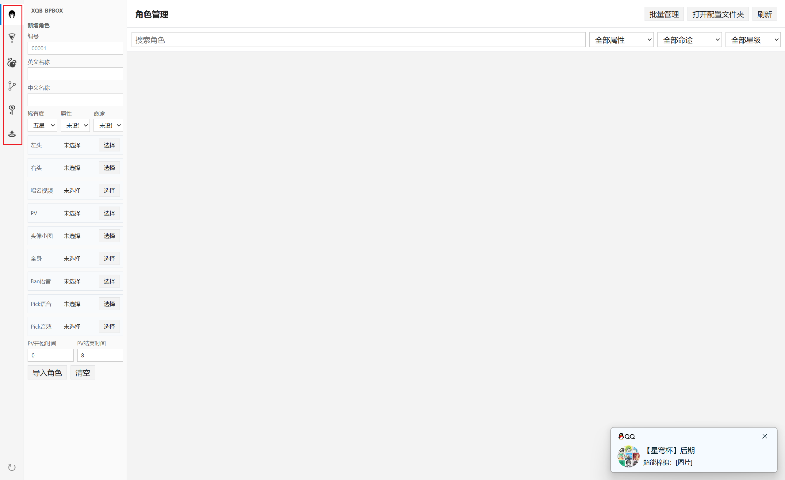
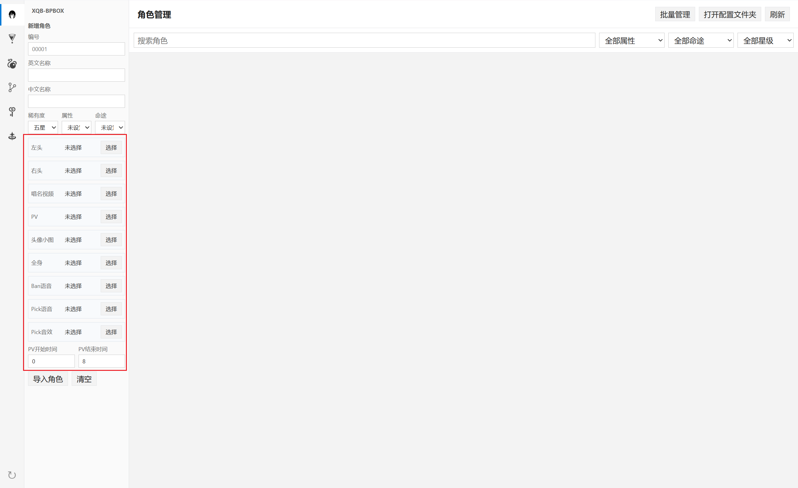
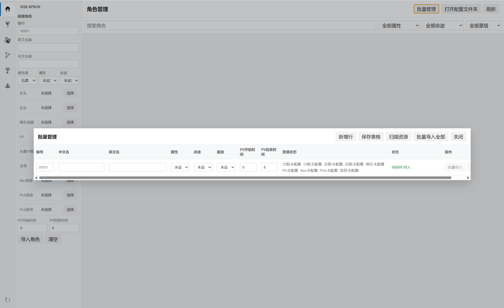
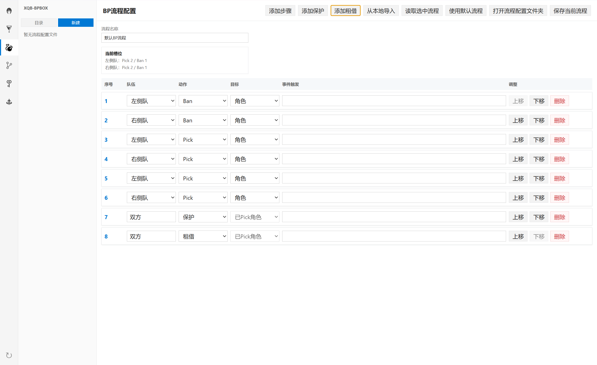
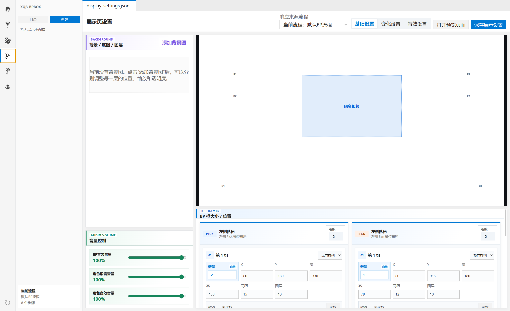
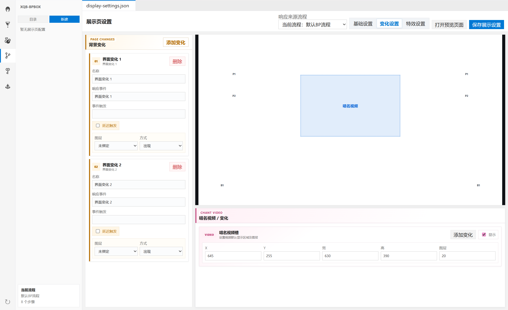
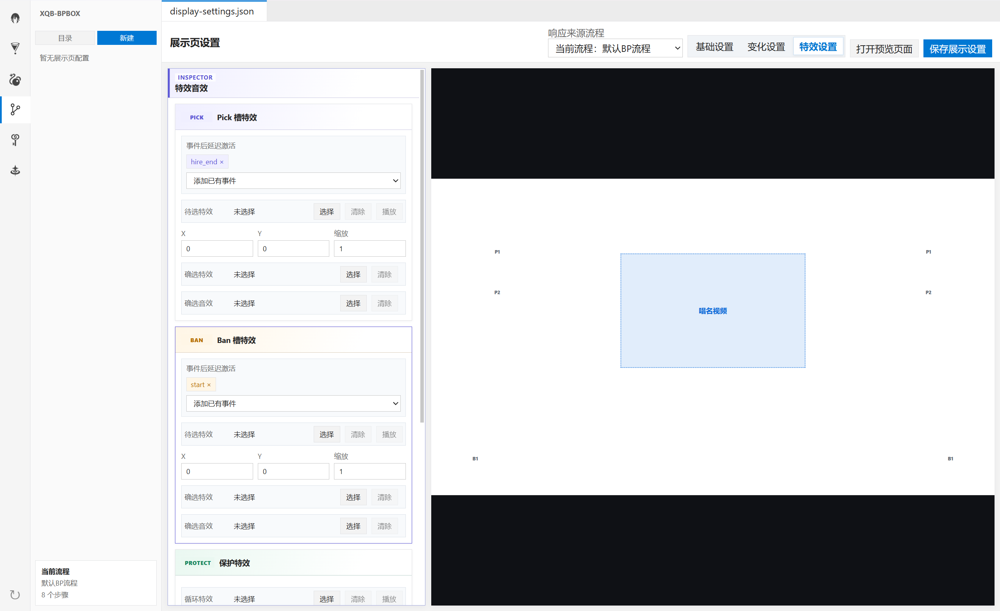
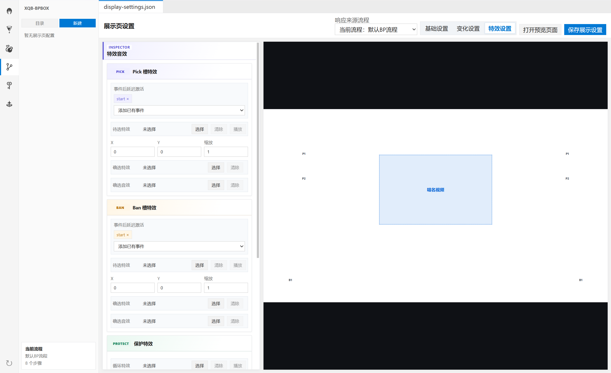
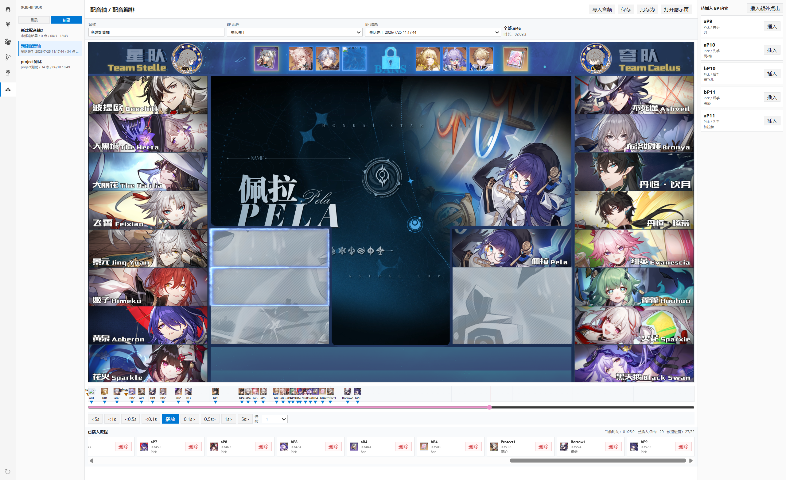
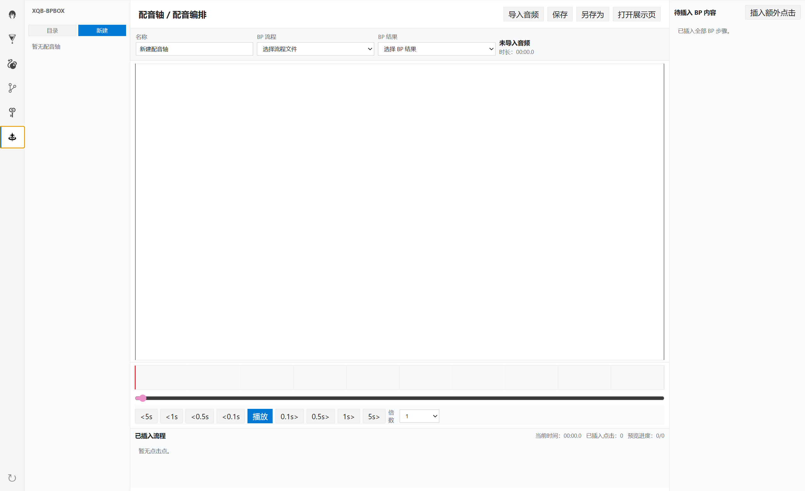

# XQB-BPBox 操作指南

本文面向直接使用安装包的普通用户，介绍素材准备、角色与光锥管理、BP 流程配置、展示页设置、现场 BP、手动回放和配音轴。文中仅说明当前软件界面已经提供的功能。

如果你只想尽快完成一次 BP，建议先阅读第 4 章的完整流程，再依次完成角色、流程、展示页和 BP 设置。

## 1. 软件用途

XQB-BPBox 是一款为《星穹杯》开发，面向《崩坏：星穹铁道》相关 BP 场景的桌面工具。它可以在本地管理角色、光锥、BP 流程、展示布局、音视频素材和 BP 结果，并通过独立展示窗口输出画面。

软件当前主要用于：

- 管理角色和光锥资料；
- 自定义 Pick、Ban、保护和租借的执行顺序；
- 配置背景、槽位、唱名视频和操作特效；
- 在现场操作 BP，并同步独立展示窗口；
- 读取已保存的 BP 结果进行手动回放；
- 将一段配音或解说音频与 BP 操作时间点对齐。

本软件是本地工具，角色资料、流程、展示设置和结果均保存在本机。请自行备份重要配置和素材。本项目不是游戏官方软件，也不代表游戏厂商或素材权利人提供授权。

## 2. 获取、安装与启动

普通用户可前往项目的 [GitHub Releases](https://github.com/1150664753/XQB-BPbox/releases) 下载发布版本。Windows 安装包的名称通常类似 `XQB-BPBox-<版本号>-setup.exe`。

基本安装步骤：

1. 下载最新的 Windows 安装程序。
2. 双击安装程序，按向导选择安装位置并完成安装。
3. 从桌面快捷方式或开始菜单启动 XQB-BPBox。
4. 第一次启动后，软件会建立本地的 `assets`、`config` 和 `results` 目录。

控制台角落的圆形箭头按钮用于检查程序更新。检测到新版本后，可以在提示中下载并立即重启更新，也可以选择稍后安装。如果在线更新失败，可重新前往 GitHub Releases 手动下载安装包。

源码运行和自行构建的方法见 [README.md](./README.md)。普通用户不需要安装 Node.js，也不需要运行开发命令。

## 3. 主界面与导航

主界面左侧提供六个功能入口：

| 入口 | 用途 |
| --- | --- |
| 角色管理 | 新增、编辑、复制、删除和批量管理角色 |
| 光锥管理 | 新增、编辑、复制和删除光锥 |
| BP流程配置 | 定义双方 Pick、Ban、保护和租借的顺序 |
| 展示页设置 | 配置展示窗口的背景、槽位、变化、视频和特效 |
| 开始BP | 现场执行 BP、保存结果或读取结果回放 |
| 配音轴 | 将音频时间与 BP 操作和额外点击对齐 |

在 BP 流程、展示设置、BP 结果和配音轴页面，左侧还会出现相应的本地文件列表。列表上方的“目录”按钮用于打开实际保存文件的文件夹。

## 4. 一次完整 BP 的推荐流程

首次使用时，建议按以下顺序准备：

1. 在“角色管理”和“光锥管理”中录入本场可能使用的内容。
2. 在“BP流程配置”中建立执行顺序，或先使用默认流程测试。
3. 在“展示页设置”中配置背景、双方槽位、唱名视频区域和特效。
4. 点击“打开预览页面”，检查画面布局、图层和素材是否正确。
5. 进入“开始BP”，选择要使用的流程和底片视频。
6. 现场操作时选择“直播 BP”；回放已保存结果时选择“手动回放”。
7. BP 结束后填写结果名称并点击“保存本局”。
8. 如需配合解说音频自动播放，再到“配音轴”插入时间点并打开展示页。

建议在正式活动前完整走一遍测试流程，并备份 `config` 和 `results`。

## 5. 素材与本地目录

### 5.1 三类主要目录

软件使用三个主要目录：

| 目录 | 内容 |
| --- | --- |
| `assets` | 角色图片、光锥图片、唱名视频、PV、语音、音效及展示素材 |
| `config` | 角色、光锥、BP 流程、展示设置和配音轴配置 |
| `results` | 已保存的 BP 结果 |

安装版将这些目录放在 XQB-BPBox 的用户数据目录中，而不是安装程序所在目录。最稳妥的定位方法是：在“角色管理”点击“打开配置文件夹”；当前打开的是 `config`，其上一级目录中可以看到同级的 `assets` 和 `results`。

源码开发环境则在项目程序目录 `XQB-BPbox` 下使用同名目录。

### 5.2 通过“选择”按钮引用素材

单个角色、光锥和展示设置都可以通过“选择”按钮指定现有文件。当前版本会记录所选文件的路径，不会自动把外部文件复制到 `assets`。

因此，完成配置后不要随意移动、改名或删除原文件。更稳妥的做法是先把长期使用的素材整理到固定目录，再在软件中选择。若路径失效，角色卡片会显示对应资源缺失，展示窗口也无法加载该素材。

文件选择窗口当前支持：

| 类型 | 常用格式 |
| --- | --- |
| 图片 | PNG、JPG、JPEG、WebP、GIF |
| 视频 | MP4、WebM、MOV、MKV |
| 音频 | MP3、WAV、OGG、M4A、AAC、FLAC |

“开始BP”中的底片视频只接受 MP4 文件。

### 5.3 本地文件自动刷新

软件会监视 `assets`、`config` 和 `results` 的变化。通过文件管理器新增或修改受支持的本地文件后，相关列表通常会自动刷新；若没有及时显示，可切换页面，或点击角色/光锥页面的“刷新”。

## 6. 角色管理

### 6.1 新增角色

进入“角色管理”，在编辑区填写：

- 编号：建议使用统一的四位或五位数字；纯数字会按五位格式补零，例如 `1` 会整理为 `00001`；
- 英文名称、中文名称：两项都需要填写；
- 稀有度：四星或五星；
- 属性：物理、火、冰、雷、风、量子或虚数；
- 命途：从当前软件提供的命途列表中选择。

然后按需要选择资源：

| 字段 | 用途 |
| --- | --- |
| 左头、右头 | 左右队伍 Pick 槽中的角色画面 |
| 唱名视频 | 角色被 Pick 或 Ban 时首先播放的短视频 |
| PV | 唱名视频之后切换播放的角色 PV |
| 头像小图 | 角色选择列表和小型展示位置 |
| 全身 | 需要完整人物图的展示位置 |
| Ban语音 | Ban 角色时播放 |
| Pick语音 | Pick 角色时播放 |
| Pick音效 | Pick 角色时与语音分别按音量设置播放 |

填写完成后点击“导入角色”。列表中的资源状态会显示左头、右头、头像、全身、视频、PV、语音和音效是否存在。

### 6.2 PV 开始时间与结束时间

“PV开始时间”表示从视频第几秒开始播放，默认是 `0`。

“PV结束时间”当前表示从视频尾部排除多少秒。默认值为 `8`，即一个 60 秒视频会播放到约 52 秒，然后从设置的开始时间重新循环。若填写 `0`，则允许播放到视频自然结束；若有效区间太短，软件会自动回退到可播放范围。

角色有唱名视频时，展示页会先播放唱名视频，通常在约 5 秒后切换到该角色 PV；没有角色 PV 时会切换回本局设置的底片视频。角色没有唱名视频时，展示页直接保持或恢复底片视频。

### 6.3 编辑、复制、删除与筛选

- 点击角色卡片上的“编辑”，修改后点击“保存角色”。
- 点击“复制”会建立一份带新名称的角色记录，适合制作素材变体。
- 点击“删除”后需要再次确认；该操作不可恢复。
- 使用搜索框、属性、命途和星级筛选快速定位角色。
- “清空”只清空当前编辑表单，不会删除已保存角色。

## 7. 角色批量管理

角色较多时，可在“角色管理”右上角打开“批量管理”。批量管理表保存在 `config/app/character-resource-table.json`。

### 7.1 推荐素材目录和命名

“扫描资源”会按目录类型和文件名中的四位或五位编号匹配角色。建议使用以下结构：

| 资源 | 推荐位置与文件名示例 |
| --- | --- |
| 左头 | `assets/characters/left/left_00001.png` |
| 右头 | `assets/characters/right/right_00001.png` |
| 头像小图 | `assets/characters/small/ban_00001.png` |
| 全身 | `assets/characters/big/pick_00001.png` |
| 唱名视频 | `assets/videos/chant/chant_00001.mp4` |
| 角色 PV | `assets/videos/PV/PV_00001.mp4` |
| Ban 语音 | `assets/audios/ban/ban_00001.wav` |
| Pick 语音 | `assets/audios/pick/pick_00001.wav` |
| Pick 音效 | `assets/audios/pick_sound/pick_sound_00001.wav` |

编号是匹配的关键。一个编号对应批量表中的一行；没有编号的文件不会自动归入某个角色。

### 7.2 批量导入步骤

1. 先把素材放入上述固定目录，并确认文件名编号一致。
2. 打开“批量管理”，点击“扫描资源”。
3. 检查每行的编号和资源状态，补充中文名、英文名、属性、命途、星级和 PV 时间。
4. 点击“保存表格”，保存当前整理结果。
5. 可在某一行点击“批量导入”，也可以点击“批量导入全部”。
6. 阅读完成提示中的新增、更新、跳过和缺失资源数量。

已有相同编号的角色会被更新；缺少编号的行会被跳过。批量表中的“删除”只移除该表格行，之后仍需点击“保存表格”保存改动。

## 8. 光锥管理

进入“光锥管理”后，可填写名称、命途和稀有度，并选择小图和大图。当前界面没有单独的光锥编号字段。

- 小图用于光锥管理列表，以及 BP 的小型槽位显示。
- 大图作为 BP 选择和展示时的优先图片；未配置大图时会回退使用小图。
- 点击“导入光锥”新增记录；编辑已有记录后按钮会变为“保存光锥”。
- 列表支持名称搜索、命途筛选和星级筛选。
- 卡片上的“复制”用于建立变体，“删除”需要确认且不可恢复。

如果计划在流程中 Ban 或 Pick 光锥，请先确认相应光锥已经导入，并至少有一张可用图片。

## 9. BP 流程配置

BP 流程决定每一步由哪一侧执行什么动作，以及选择角色还是光锥。流程文件保存在 `config/bp`。

### 9.1 创建和编辑流程

1. 进入“BP流程配置”，填写流程名称。
2. 点击“添加步骤”增加普通 Pick/Ban 步骤。
3. 为普通步骤选择左侧队或右侧队、Pick 或 Ban、角色或光锥。
4. 如需双方保护已 Pick 角色，点击“添加保护”。
5. 如需双方租借对方已 Pick 角色，点击“添加租借”。
6. 使用上移、下移和删除调整顺序。
7. 点击“保存当前流程”。流程至少需要一个步骤。

保护和租借步骤固定作用于双方已 Pick 的角色，所以队伍显示为“双方”，目标也不能改为光锥。

表格上方的“当前槽位”会统计左右队伍各自的 Pick 和 Ban 数量，可在配置展示槽位时作为参考。

### 9.2 事件触发

每个流程步骤的“事件触发”是一个事件名称，用于通知展示页执行对应变化。它需要与“展示页设置 → 变化设置”中的“响应事件”完全一致。

例如，某一步填写事件 `show_pick_bg`，背景变化的“响应事件”也填写 `show_pick_bg`，执行该步骤时就会触发这项变化。事件名称建议使用简短、唯一且容易识别的英文或数字组合，避免前后空格。

### 9.3 读取、导入和管理流程

- 左侧列表中选择一个流程时，编辑器会读取该文件；也可点击“读取选中流程”。
- “使用默认流程”会把编辑区恢复为软件内置的简短测试流程，不会自动保存。
- “从本地导入”可以读取其他位置的流程 JSON；读取后仍需点击“保存当前流程”，才能保存到 `config/bp`。
- “打开流程配置文件夹”或左侧“目录”可直接打开 `config/bp`。
- 流程列表支持右键新建、打开目录、重命名和删除。

## 10. 展示页设置与预览

展示页设置文件保存在 `config/display`。顶部的“响应来源流程”用于选择事件名称的参考流程，建议选中实际用于本场 BP 的流程。

“打开预览页面”会打开独立预览窗口。调整展示设置时，当前改动会实时发送到已打开的预览页和展示页，适合边看边调；但仍需点击“保存展示设置”才能写入配置文件。

展示画布按 1920 × 1080 的逻辑尺寸设计。X、Y、宽、高和图层数值都以这套画布为基准，窗口缩放不会改变配置本身。

## 11. 展示页基础设置

### 11.1 背景、底图和图层

在“基础设置”的“背景 / 底图 / 图层”区域：

1. 点击“添加背景图”并选择图片。
2. 为图层填写便于识别的名称。
3. 调整 X、Y、缩放、透明度和图层。
4. 使用“显示”控制当前图层是否可见。
5. 使用“上移”“下移”整理编辑列表，使用“删除”移除图层。

“图层”数值决定画面前后遮挡关系。若素材意外被挡住，先检查图层值，再检查是否勾选“显示”。

### 11.2 音量

基础设置中可分别调整：

- BP 音效音量：Pick、Ban、保护、租借槽位的确选音效；
- 角色语音音量：角色 Pick 或 Ban 语音；
- 角色音效音量：角色自己的 Pick 音效。

三个值均为 0–100。软件内音量正常但听不到声音时，还应检查系统音量和直播软件的音频采集设置。

### 11.3 Pick / Ban 槽位

左右双方的 Pick 和 Ban 都可以设置多个槽位组。每组可配置：

- 槽位数量；
- 横向或纵向排列；
- X、Y、宽、高、间距和图层；
- 各槽位之间的单独间距；
- 槽位框图片。

选择槽位框图片后，可点击右侧“×”清除，恢复为无框图状态。

第一组槽位数量为 `0` 时会根据当前流程自动计算。复杂布局可以增加多个组，把不同槽位分开定位。

## 12. 展示页变化设置

“变化设置”包含背景变化和唱名视频区域变化。

### 12.1 背景变化

点击“添加变化”后配置：

| 字段 | 说明 |
| --- | --- |
| 名称 | 仅用于识别这项变化 |
| 响应事件 | 收到哪个流程事件时执行；需与流程步骤的“事件触发”一致 |
| 事件触发 | 执行这项变化时继续发出的事件，可用于连锁触发；不需要时留空 |
| 图层 | 这项变化作用于哪个背景图层 |
| 方式 | 出现、消失、飞入、飞出、展开或收缩 |
| 方向/起点 | 飞入或飞出时的运动方向和自定义起点 |
| 时间 ms | 飞入、飞出、展开或收缩的动画时长 |

“响应事件”与流程事件是最容易填错的地方，大小写和字符必须一致。

### 12.2 唱名视频槽变化

“唱名视频槽”先定义视频的默认 X、Y、宽、高、图层和是否显示。点击该区域的“添加变化”，可以让特定事件改变视频区域的位置、大小和变化速度。

每条唱名视频变化右侧的“预览框”会打开或更新预览页，直接显示该变化配置的目标位置和尺寸，不会推进 BP 流程或影响正式展示页。

### 12.3 延迟触发和额外点击

勾选“延迟触发”后，事件到达时不会立刻完成这项变化，而是等待设定次数的额外点击。该功能适合把一个流程步骤拆成多个现场画面节拍。

直播 BP 时，控制台会显示还需多少次额外点击，并暂时阻止下一项角色或光锥选择。必须点击“触发额外点击”完成这些节拍后，才能继续 BP。手动回放和配音轴中也要为这些变化预留额外点击。

## 13. 展示页特效设置

“特效设置”分别提供 Pick 槽、Ban 槽、保护和租借四类特效。

### 13.1 Pick 和 Ban 槽特效

- “待选特效”用于槽位等待或进入待选状态时显示的视频；
- “事件后延迟激活”用于指定哪些事件发生前不启用待选特效；
- X、Y 和缩放控制待选特效位置；
- “确选特效”在操作确认后播放；
- “确选音效”在操作确认后播放。

### 13.2 保护和租借特效

保护和租借使用“循环特效”。勾选“一直循环”后，特效会保持循环；同时也可以分别配置确选特效和确选音效。点击“播放”可在独立预览中检查循环视频。

素材文件较大时，预览首次加载可能需要时间。正式活动前应逐项测试确选视频、循环视频和音效。

## 14. 开始 BP 前的准备

进入“开始BP”后，先完成以下检查：

1. 在左侧结果列表点击“新建 BP”，或确认当前记录可以继续使用。
2. 在“流程”卡片选择流程，并点击“应用所选流程”；若要使用刚刚编辑但尚未从列表读取的流程，可点击“同步编辑中的流程”。
3. 填写“结果名称”。
4. 在“底片视频”选择一个 MP4 文件，并设置开始时间和结束时间。
5. 确认顶部显示的流程名称、步骤数量和左右槽位数量正确。
6. 根据用途选择“直播 BP”或“手动回放”。

底片视频用于没有角色唱名/PV 正在播放时的默认视频。它的“结束时间”与角色 PV 一样，表示从视频尾部排除多少秒。选择底片视频时，软件会同时建立或更新当前 BP 结果记录。

## 15. 直播 BP 操作

点击“直播 BP”后，软件会打开独立展示窗口，并把控制台中的操作实时同步过去。

### 15.1 Pick 和 Ban

1. 查看中间顶部的当前步骤，确认队伍、动作和目标类型。
2. 使用搜索、属性、命途和星级筛选找到目标。
3. 单击角色或光锥卡片。
4. 当前版本会立即确认选择并进入下一步，不需要再点击单独的“确认”按钮。

已经 Pick 或 Ban 的角色、光锥会被禁用，不能在后续普通步骤重复选择。

### 15.2 保护

保护步骤会要求双方各选择一个已经 Pick 的角色。分别在左侧队和右侧队的 Pick 区点击要保护的角色；双方都选好后，软件自动确认并进入下一步。

### 15.3 租借

租借步骤要求双方从对方已经 Pick 的角色中选择：

- 左侧队要租借某角色时，点击右侧队 Pick 区中的该角色；
- 右侧队要租借某角色时，点击左侧队 Pick 区中的该角色。

双方都选好后会自动确认。已经被保护的角色不能被对方租借。

### 15.4 撤回、清空和保存

- “撤回上一步”移除最后一条操作，并重置当前的延迟点击状态。
- “清空本局”清除本局操作，使进度回到开头。
- “保存本局”把当前记录写入 `results/bp`。

BP 结果不会在每个步骤后自动保存。正式活动中建议在关键节点手动保存；新建或重置前也应确认需要的内容已经保存。

## 16. 直播中的延迟变化

若当前事件触发了“延迟触发”的背景或视频变化，“开始BP”页面会显示“等待额外点击”和剩余次数。

此时按以下顺序操作：

1. 观察独立展示窗口，确认当前画面已到达预期节拍。
2. 点击控制台中的“触发额外点击”。
3. 如果仍显示剩余次数，按节拍继续点击。
4. 提示消失后，再选择下一名角色或光锥。

等待额外点击时角色和光锥卡片会被禁用，这是正常保护机制，不是界面卡死。

## 17. 手动回放与快捷键

“手动回放”用于按操作记录逐步重放展示。常见做法是先从左侧选择一个已保存结果，点击“读取选中结果”，然后点击“手动回放”打开独立展示窗口。

手动快捷键只在独立展示窗口生效：

| 操作 | 效果 |
| --- | --- |
| `→` | 前进一次点击 |
| `Space` | 前进一次点击 |
| 小键盘 `6` | 前进一次点击 |
| 鼠标左键单击展示窗口 | 前进一次点击 |
| `←` | 后退一个 BP 操作，并重置当前临时变化状态 |

一次“前进”不一定对应一个 BP 步骤：如果当前有延迟变化，点击会先被用于完成额外点击，之后的点击才推进 BP。

当展示窗口由配音轴联动时，上述键盘和鼠标手动推进会被禁用，避免破坏音频同步。

## 18. 保存、读取和管理 BP 结果

BP 结果文件保存在 `results/bp`，内容包括流程、操作记录、左右队伍状态和底片视频设置。

- 保存：填写结果名称，点击“保存本局”。
- 读取：从左侧列表选择文件，再点击“读取选中结果”。读取后软件切换到手动回放模式。
- 新建：点击左侧“新建 BP”；若当前有未保存操作，软件会提示确认。
- 重命名或删除：在左侧结果条目上点击右键。
- 打开文件夹：点击列表上方“目录”。

结果文件是 JSON 文本，但普通用户建议通过软件管理。手工修改格式错误可能导致文件无法读取。

## 19. 独立展示窗口与 OBS

展示窗口是用于观众画面的独立窗口。直播 BP、手动回放和配音轴联动都会使用它；展示设置中的预览窗口则主要用于调试布局。

在 OBS 中可按通用方式接入：

1. 先在 XQB-BPBox 中打开独立展示窗口。
2. 在 OBS 场景中新增“窗口采集”。
3. 选择 XQB-BPBox 的展示窗口，而不是控制台窗口。
4. 将采集源调整为 16:9，并按 1920 × 1080 画布检查裁切。
5. 在 OBS 音频混音器中确认展示窗口的声音已经被采集。

如果窗口列表中看不到展示页，先关闭采集源属性再重新打开，或重新打开 XQB-BPBox 展示窗口。不同系统和 OBS 版本的采集方式可能不同，必要时可改用显示器采集做排查。

## 20. 配音轴

配音轴用于让一段音频在指定时间自动推进 BP 展示。配音轴文件保存在 `config/audio`。

### 20.1 创建配音轴

1. 进入“配音轴”，填写名称。
2. 选择 BP 流程和已经保存的 BP 结果。
3. 点击“导入音频”选择配音或解说文件。
4. 播放或拖动时间轴，把播放头移动到目标时间。
5. 在“待插入 BP 内容”中找到下一项操作，点击“插入”。
6. 重复操作，直到所需 BP 步骤都已经放到时间轴。
7. 点击“保存”；需要保留原文件时使用“另存为”。

已插入标记可以直接点击定位，也可以在时间轴上水平拖动来微调时间。控制区提供前后跳转 5、1、0.5 和 0.1 秒，以及 0.5×、0.75×、1×、1.25×、1.5×、2× 播放速度。

### 20.2 插入额外点击

当展示设置含有延迟变化时，配音轴会提示 BP 点击可能被拦截。把播放头移到希望变化继续的时间，点击“插入额外点击”。额外点击和 BP 步骤都会出现在“已插入流程”中，可单独删除或拖动。

额外点击的数量和顺序需要与展示变化中的“额外点击次数”一致，否则后续 BP 时间点会提前或延后。

### 20.3 联动展示页

点击“打开展示页”前必须具备：

- 已导入的音频；
- 已选择的 BP 流程；
- 已选择的 BP 结果。

展示页打开后，播放、暂停、时间位置、速度和点击点会同步到独立窗口。若没有插入任何点击点，展示页只播放音频，不会自动推进 BP。

配音轴联动期间，控制台内的媒体预览可能暂停，以减少重复播放和设备负担；关闭独立展示页后会恢复。

## 21. 配置和数据文件管理

### 21.1 文件位置

| 内容 | 相对位置 |
| --- | --- |
| 角色 | `config/app/characters.json` |
| 光锥 | `config/app/light-cones.json` |
| 角色批量表 | `config/app/character-resource-table.json` |
| BP 流程 | `config/bp/*.json` |
| 展示设置 | `config/display/*.json` |
| 配音轴 | `config/audio/*.json` |
| BP 结果 | `results/bp/*.json` |

### 21.2 左侧文件列表操作

BP 流程、展示设置、BP 结果和配音轴的文件列表采用相同操作方式：

- 点击条目可选中或读取；
- 点击“目录”打开实际文件夹；
- 在条目上点击右键可重命名或删除；
- 在列表空白区域点击右键可新建或打开目录；
- 重命名时按 `Enter` 确认，按 `Esc` 取消；
- 点击窗口其他位置或按 `Esc` 可关闭右键菜单。

删除文件前会出现确认提示。配置文件和结果文件被删除后通常无法在软件内恢复，请先做备份。

### 21.3 备份与迁移

迁移到另一台电脑时，建议同时复制：

1. 整个 `config` 目录；
2. 整个 `results` 目录；
3. `assets` 目录及所有从外部路径引用的素材。

如果只复制配置但没有复制素材，配置中的路径可能失效。复制完成后应逐页检查角色资源状态、展示预览和声音。

## 22. 常见问题

### 22.1 角色、光锥或背景不显示

先在对应管理页查看资源状态，再确认文件是否被移动、重命名或删除。通过“选择”按钮重新指定文件后保存。批量角色还应检查素材目录和文件名中的四位或五位编号。

### 22.2 唱名视频能播放，但没有切换到 PV

确认角色的“PV”字段已经选择有效视频，并检查 PV 开始时间和结束时间。结束时间是从尾部排除的秒数；数值过大可能使有效区间不足。没有角色 PV 时，软件会回到底片视频，这是正常行为。

### 22.3 展示页没有声音

依次检查素材文件本身、展示页基础设置中的三类音量、Windows 音量合成器，以及 OBS 是否采集了展示窗口音频。角色 Pick 音效、角色语音和 BP 确选音效使用不同音量设置。

### 22.4 背景变化或视频变化没有触发

确认流程步骤的“事件触发”和变化设置的“响应事件”完全一致；确认变化绑定了正确图层；确认当前展示配置已经保存并加载；最后在预览页用相同步骤重新测试。

### 22.5 直播 BP 中无法点击角色或光锥

查看页面是否显示“等待额外点击”。如有提示，先按要求点击“触发额外点击”。若当前是保护或租借步骤，需要直接点击左右队伍中已经 Pick 的角色，而不是中间角色列表。

### 22.6 手动回放按键没有反应

先单击独立展示窗口让它获得焦点，并确认已经读取含有操作记录的结果。如果当前由配音轴联动，手动快捷键会被禁用；关闭配音轴联动展示页后再试。

### 22.7 配音轴只播放声音，不推进 BP

确认已经选择 BP 流程和 BP 结果，并且时间轴上已经插入 BP 步骤。存在延迟变化时，还要插入足够数量的额外点击。

### 22.8 文件列表没有出现手工放入的 JSON

确认文件放在页面“目录”按钮打开的实际目录中，并检查扩展名是否为 `.json`。无效 JSON 可能显示为文件名但无法正常读取；建议恢复备份，不要继续覆盖原文件。

### 22.9 OBS 采集黑屏或画面尺寸不对

确认选择的是已打开的展示窗口，并在 OBS 中重新选择捕获方式。画面按 1920 × 1080 逻辑尺寸设计；若 OBS 画布不是 16:9，可使用“适配屏幕”后再调整裁切。
